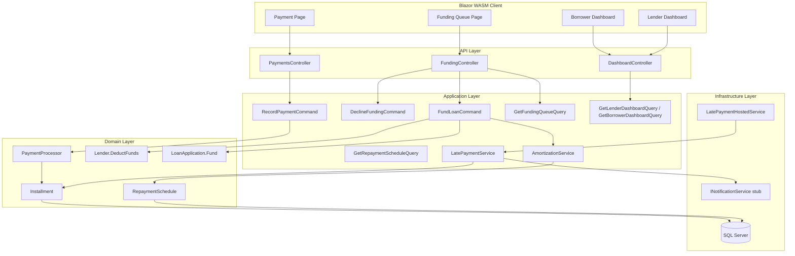
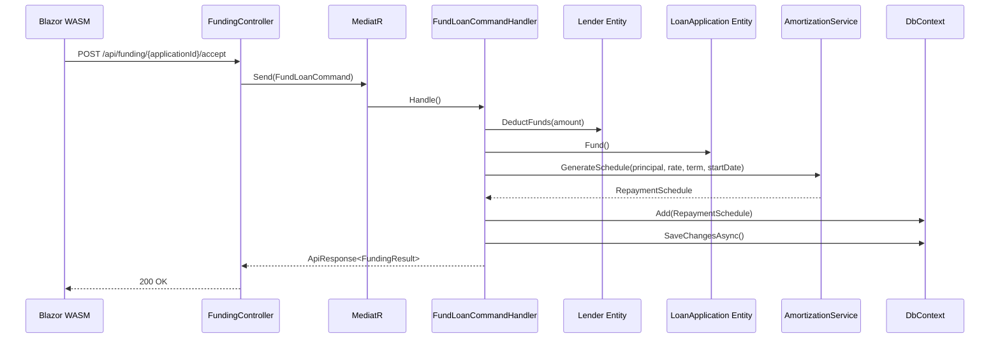
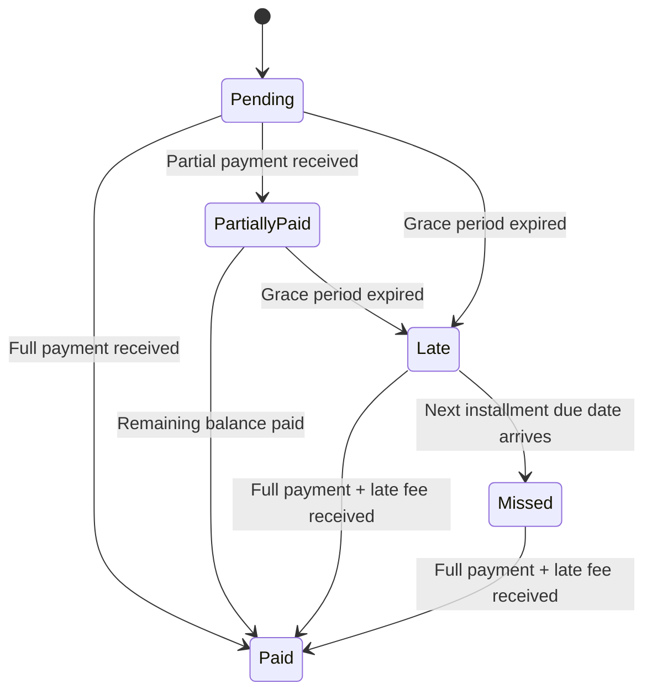

# Design Document: Lender Funding & Repayment Engine

## Overview

This design describes the technical architecture for the Lender Funding and Repayment Engine — a feature that enables lenders to fund approved loan applications, generates amortization schedules, processes borrower payments, detects late/defaulted loans, and provides portfolio dashboards.

The system follows the existing Clean Architecture layering:
- **Domain**: New entities (`RepaymentSchedule`, `Installment`), enums (`InstallmentStatus`, `LoanPerformance`), and domain service (`PaymentProcessor`)
- **Application**: `AmortizationService` (pure EMI calculation), CQRS commands/queries via MediatR, `LatePaymentService` background job
- **Infrastructure**: EF Core persistence, email notification stubs, hosted service registration
- **API**: REST controllers for funding, payments, and dashboard queries
- **Blazor WASM**: Funding queue, payment UI, lender/borrower dashboards

### Key Design Decisions

| Decision | Rationale |
|----------|-----------|
| `AmortizationService` as a pure function in Application layer | No side effects — takes principal, rate, term and returns a schedule. Easy to test with property-based testing. |
| `PaymentProcessor` as a domain service | Orchestrates state transitions across `Installment` and `RepaymentSchedule` while enforcing business rules. |
| `LatePaymentService` as `IHostedService` with timer | Runs daily detection without external scheduler dependency. Uses `IServiceScopeFactory` for scoped DbContext. |
| `Lender.DeductFunds(decimal)` method on domain entity | Keeps capital enforcement as a domain invariant, consistent with existing entity patterns (e.g., `LoanApplication.Fund()`). |
| Installment state machine in domain | State transitions are guarded by domain logic, preventing invalid status changes. |
| Credit tier rate adjustment at funding time | Effective rate = `LoanProduct.InterestRate + CreditTierAdjustment` calculated once and stored on `RepaymentSchedule`. |

## Architecture



### Request Flow: Fund a Loan



## Components and Interfaces

### Domain Layer

#### New Enums

```csharp
public enum InstallmentStatus
{
    Pending,
    Paid,
    PartiallyPaid,
    Late,
    Missed
}

public enum LoanPerformance
{
    OnTime,
    Late,
    Defaulted
}
```

#### Lender Entity Extension

```csharp
// Added to existing Lender entity
public void DeductFunds(decimal amount)
{
    if (amount <= 0)
        throw new DomainException("Deduction amount must be greater than zero.");
    if (amount > AvailableFunds)
        throw new DomainException("Insufficient available funds.");

    AvailableFunds -= amount;
    MarkUpdated();
}
```

#### PaymentProcessor Domain Service

```csharp
public interface IPaymentProcessor
{
    void RecordFullPayment(Installment installment, DateTime paymentDate);
    void RecordPartialPayment(Installment installment, decimal amount, DateTime paymentDate);
}
```

### Application Layer

#### AmortizationService

```csharp
public interface IAmortizationService
{
    RepaymentSchedule GenerateSchedule(
        Guid loanApplicationId,
        Guid lenderId,
        decimal principal,
        decimal annualInterestRate,
        int termMonths,
        DateTime fundingDate);
}
```

#### Commands

| Command | Description |
|---------|-------------|
| `FundLoanCommand` | Accepts funding: deducts funds, transitions loan, generates schedule |
| `DeclineFundingCommand` | Records decline reason, removes from queue |
| `RecordPaymentCommand` | Records a borrower payment (full or partial) |

#### Queries

| Query | Description |
|-------|-------------|
| `GetFundingQueueQuery` | Returns approved applications for lender's products |
| `GetRepaymentScheduleQuery` | Returns schedule with installments for a loan |
| `GetLenderDashboardQuery` | Returns portfolio metrics for a lender |
| `GetBorrowerDashboardQuery` | Returns loan summary for a borrower |
| `GetPaymentHistoryQuery` | Returns payment history for a specific loan |

### Infrastructure Layer

#### LatePaymentHostedService

```csharp
public class LatePaymentHostedService : IHostedService, IDisposable
{
    // Runs daily via Timer
    // Uses IServiceScopeFactory to create scoped DbContext
    // Delegates to LatePaymentService for detection logic
}
```

#### INotificationService

```csharp
public interface INotificationService
{
    Task SendPaymentReminderAsync(Guid borrowerId, Guid installmentId, decimal amount, DateTime dueDate);
    Task SendLatePaymentNoticeAsync(Guid borrowerId, Guid installmentId, decimal overdueAmount, decimal lateFee);
    Task SendDefaultNoticeAsync(Guid borrowerId, Guid loanApplicationId);
}
```

### API Layer

#### FundingController

| Endpoint | Method | Description |
|----------|--------|-------------|
| `/api/funding/queue` | GET | Get funding queue for authenticated lender |
| `/api/funding/{applicationId}/details` | GET | Get full application details |
| `/api/funding/{applicationId}/accept` | POST | Accept funding |
| `/api/funding/{applicationId}/decline` | POST | Decline funding |

#### PaymentsController

| Endpoint | Method | Description |
|----------|--------|-------------|
| `/api/payments/{scheduleId}/pay` | POST | Record a payment |
| `/api/payments/{scheduleId}/history` | GET | Get payment history |
| `/api/payments/{scheduleId}` | GET | Get repayment schedule |

#### DashboardController Extensions

| Endpoint | Method | Description |
|----------|--------|-------------|
| `/api/dashboard/lender/portfolio` | GET | Lender portfolio summary |
| `/api/dashboard/lender/loans` | GET | Lender funded loans list |
| `/api/dashboard/lender/earnings` | GET | Lender earnings tracker |
| `/api/dashboard/borrower/loans` | GET | Borrower active loans |
| `/api/dashboard/borrower/upcoming` | GET | Borrower upcoming payments |

## Data Models

### RepaymentSchedule Entity

```csharp
public sealed class RepaymentSchedule : AuditableEntity
{
    public Guid LoanApplicationId { get; private set; }
    public Guid LenderId { get; private set; }
    public decimal FundedAmount { get; private set; }
    public decimal AnnualInterestRate { get; private set; }
    public int TermMonths { get; private set; }
    public decimal MonthlyEmi { get; private set; }
    public decimal TotalInterestPayable { get; private set; }
    public LoanPerformance Performance { get; private set; }
    public DateTime GeneratedAtUtc { get; private set; }

    public IReadOnlyCollection<Installment> Installments => _installments.AsReadOnly();
    private readonly List<Installment> _installments = [];

    // Navigation properties
    public LoanApplication LoanApplication { get; private set; } = null!;
    public Lender Lender { get; private set; } = null!;
}
```

### Installment Entity

```csharp
public sealed class Installment : AuditableEntity
{
    public Guid RepaymentScheduleId { get; private set; }
    public int InstallmentNumber { get; private set; }       // 1-based
    public DateTime DueDate { get; private set; }
    public decimal PrincipalPortion { get; private set; }
    public decimal InterestPortion { get; private set; }
    public decimal TotalAmount { get; private set; }         // Principal + Interest
    public decimal RemainingBalance { get; private set; }    // Balance after this installment
    public InstallmentStatus Status { get; private set; }
    public decimal PaidAmount { get; private set; }
    public DateTime? PaidDate { get; private set; }
    public decimal LateFeeAmount { get; private set; }
    public string? Notes { get; private set; }

    // Navigation property
    public RepaymentSchedule RepaymentSchedule { get; private set; } = null!;
}
```

### Installment State Machine



### EF Core Configuration

```csharp
public class RepaymentScheduleConfiguration : IEntityTypeConfiguration<RepaymentSchedule>
{
    public void Configure(EntityTypeBuilder<RepaymentSchedule> builder)
    {
        builder.ToTable("RepaymentSchedules");
        builder.HasKey(x => x.Id);
        builder.Property(x => x.FundedAmount).HasPrecision(18, 2);
        builder.Property(x => x.AnnualInterestRate).HasPrecision(5, 2);
        builder.Property(x => x.MonthlyEmi).HasPrecision(18, 2);
        builder.Property(x => x.TotalInterestPayable).HasPrecision(18, 2);
        builder.HasOne(x => x.LoanApplication).WithOne().HasForeignKey<RepaymentSchedule>(x => x.LoanApplicationId);
        builder.HasOne(x => x.Lender).WithMany().HasForeignKey(x => x.LenderId);
        builder.HasMany(x => x.Installments).WithOne(x => x.RepaymentSchedule).HasForeignKey(x => x.RepaymentScheduleId);
        builder.HasIndex(x => x.LoanApplicationId).IsUnique();
        builder.HasIndex(x => x.LenderId);
    }
}

public class InstallmentConfiguration : IEntityTypeConfiguration<Installment>
{
    public void Configure(EntityTypeBuilder<Installment> builder)
    {
        builder.ToTable("Installments");
        builder.HasKey(x => x.Id);
        builder.Property(x => x.PrincipalPortion).HasPrecision(18, 2);
        builder.Property(x => x.InterestPortion).HasPrecision(18, 2);
        builder.Property(x => x.TotalAmount).HasPrecision(18, 2);
        builder.Property(x => x.RemainingBalance).HasPrecision(18, 2);
        builder.Property(x => x.PaidAmount).HasPrecision(18, 2);
        builder.Property(x => x.LateFeeAmount).HasPrecision(18, 2);
        builder.Property(x => x.Notes).HasMaxLength(500);
        builder.HasIndex(x => new { x.RepaymentScheduleId, x.InstallmentNumber }).IsUnique();
        builder.HasIndex(x => new { x.Status, x.DueDate });
    }
}
```

### Configuration Settings

```csharp
public class RepaymentSettings
{
    public int GracePeriodDays { get; set; } = 5;
    public decimal LateFeePercentage { get; set; } = 0.02m; // 2%
    public int ConsecutiveMissedForDefault { get; set; } = 3;
    public int UpcomingPaymentReminderDays { get; set; } = 3;
}
```

## Correctness Properties

*A property is a characteristic or behavior that should hold true across all valid executions of a system — essentially, a formal statement about what the system should do. Properties serve as the bridge between human-readable specifications and machine-verifiable correctness guarantees.*

### Property 1: Amortization Principal Round-Trip

*For any* valid combination of principal amount (> 0), annual interest rate (> 0, ≤ 100), and term months (> 0), generating an amortization schedule and summing all installments' principal portions SHALL equal the original principal amount within 0.01 currency units.

**Validates: Requirements 4.3, 4.7**

### Property 2: Interest Calculation Per Installment

*For any* generated amortization schedule, each installment's interest portion SHALL equal the remaining balance before that installment multiplied by the monthly interest rate (annual rate / 12 / 100), rounded to 2 decimal places.

**Validates: Requirements 4.8**

### Property 3: EMI Formula Correctness

*For any* valid principal P, annual interest rate, and term n months, the calculated monthly EMI SHALL equal P × r × (1+r)^n / ((1+r)^n - 1) where r is the monthly rate (annual rate / 12 / 100), within 0.01 currency units.

**Validates: Requirements 4.2**

### Property 4: Schedule Generation Structural Invariants

*For any* valid principal, rate, term, and funding date, the generated schedule SHALL have exactly `term` installments, each with sequential 1-based numbering, due dates on the same day of successive months starting one month after funding, all with initial status Pending, and each installment's remaining balance SHALL equal the previous installment's remaining balance minus the current installment's principal portion.

**Validates: Requirements 4.1, 4.4, 4.5, 4.6**

### Property 5: Payment Overflow Prevention

*For any* installment with any existing paid amount and any applicable late fee, the Payment Processor SHALL reject any payment amount that would cause the cumulative paid amount to exceed the installment's total amount plus the late fee amount.

**Validates: Requirements 8.5**

### Property 6: Late Detection Only After Grace Period

*For any* installment in Pending or PartiallyPaid status, the Late Payment Service SHALL mark it as Late only when the current date exceeds the due date plus the configured grace period days. Installments within the grace period SHALL remain in their current status.

**Validates: Requirements 9.1**

### Property 7: Default Detection at Exactly Three Consecutive

*For any* repayment schedule, the loan's performance SHALL be classified as Defaulted if and only if there exist 3 or more consecutive installments with status Late or Missed. Fewer than 3 consecutive Late/Missed installments SHALL NOT trigger default status.

**Validates: Requirements 10.1, 13.2**

### Property 8: Capital Enforcement — Insufficient Funds Rejection

*For any* lender with available funds F and any funding request with amount A where A > F, the Funding Engine SHALL reject the funding request. The lender's available funds SHALL remain unchanged after rejection.

**Validates: Requirements 2.5, 3.1**

### Property 9: Sequential Payment Order Enforcement

*For any* repayment schedule with multiple installments, the Payment Processor SHALL only accept payment on the earliest installment that is in Pending, PartiallyPaid, Late, or Missed status. Attempts to pay any other installment SHALL be rejected.

**Validates: Requirements 7.2**

### Property 10: Partial Payment Accumulation and Completion

*For any* sequence of positive partial payments on an installment whose cumulative sum equals the total installment amount (plus any late fee), the final payment SHALL transition the installment status to Paid, and the recorded paid amount SHALL equal the total amount plus late fee.

**Validates: Requirements 8.1, 8.2, 8.3, 8.4**

### Property 11: Funds Deduction Correctness

*For any* lender with available funds F and any valid funding amount A where A ≤ F, after successful funding the lender's available funds SHALL equal F - A exactly.

**Validates: Requirements 2.3**

## Error Handling

### Domain Exceptions

| Scenario | Exception | Message |
|----------|-----------|---------|
| Fund amount > available funds | `DomainException` | "Insufficient available funds." |
| Fund non-Approved application | `InvalidOperationException` | "Only approved applications can be funded." |
| Payment on Paid installment | `DomainException` | "Cannot make payment on a fully paid installment." |
| Payment amount ≤ 0 | `DomainException` | "Payment amount must be greater than zero." |
| Payment exceeds remaining | `DomainException` | "Payment amount exceeds outstanding balance." |
| Pay non-next installment | `DomainException` | "Payments must be made on the next due installment." |
| Deduct amount ≤ 0 | `DomainException` | "Deduction amount must be greater than zero." |
| Invalid amortization inputs | `DomainException` | "Principal, rate, and term must be positive values." |

### Application-Level Error Handling

- **Concurrency**: Optimistic concurrency on `Lender.AvailableFunds` via EF Core row version. If two funding requests race, the second gets a `DbUpdateConcurrencyException` wrapped in a user-friendly "Please retry" response.
- **Transaction scope**: `FundLoanCommandHandler` wraps deduction + status change + schedule generation in a single `SaveChangesAsync` call for atomicity.
- **Background job failures**: `LatePaymentHostedService` catches exceptions per-installment, logs them, and continues processing remaining installments. Failed installments are retried on the next daily run.
- **Notification failures**: Notification sending is fire-and-forget with logging. Payment processing does not fail if notification delivery fails.

### API Error Responses

All errors follow the existing `ApiResponse<T>` pattern:

```csharp
// Validation errors → 400 Bad Request
ApiResponse<T>.Failure("Payment amount must be greater than zero.")

// Domain rule violations → 422 Unprocessable Entity
ApiResponse<T>.Failure("Insufficient available funds.")

// Not found → 404
ApiResponse<T>.Failure("Loan application not found.")

// Authorization → 403 (handled by pipeline behaviour)
```

## Testing Strategy

### Property-Based Testing

**Library**: [FsCheck](https://fscheck.github.io/FsCheck/) with xUnit integration (`FsCheck.Xunit`)

**Rationale**: The amortization service is a pure function with a large input space (any valid principal × rate × term combination). Property-based testing is ideal for verifying mathematical invariants that must hold across all inputs.

**Configuration**: Minimum 100 iterations per property test.

**Tag format**: `Feature: lender-funding-repayment, Property {number}: {property_text}`

**Properties to implement**:

| Property | Target Component | Input Generators |
|----------|-----------------|------------------|
| 1: Principal round-trip | `AmortizationService` | Principal: 100–1,000,000; Rate: 1–30%; Term: 1–360 months |
| 2: Interest calculation | `AmortizationService` | Same as above |
| 3: EMI formula | `AmortizationService` | Same as above |
| 4: Structural invariants | `AmortizationService` | Same as above + random funding dates |
| 5: Payment overflow | `PaymentProcessor` | Random installments with paid amounts 0–total, random payment amounts |
| 6: Late detection timing | `LatePaymentService` | Random due dates, grace periods 1–30, current dates relative to due+grace |
| 7: Default detection | `LatePaymentService` | Random sequences of InstallmentStatus (length 1–24) |
| 8: Capital enforcement | `Lender.DeductFunds` | Random available funds 0–10M, random request amounts |
| 9: Sequential order | `PaymentProcessor` | Random schedules with mixed statuses |
| 10: Partial accumulation | `PaymentProcessor` | Random partial payment sequences summing to total |
| 11: Funds deduction | `Lender.DeductFunds` | Random valid deduction amounts ≤ available |

### Unit Tests (Example-Based)

| Area | Tests |
|------|-------|
| `Lender.DeductFunds` | Exact deduction, zero remaining, negative amount rejection |
| `LoanApplication.Fund()` | Status transition from Approved, rejection from other statuses |
| `Installment` state machine | Each valid transition, rejection of invalid transitions |
| `FundLoanCommandHandler` | Happy path integration, insufficient funds, non-approved rejection |
| `RecordPaymentCommandHandler` | Full payment, partial payment, already paid rejection |
| Dashboard calculations | Known data sets with expected metric values |

### Integration Tests

| Area | Tests |
|------|-------|
| Funding flow | End-to-end: accept funding → schedule generated → lender funds reduced |
| Payment flow | Record payment → installment updated → dashboard reflects change |
| Authorization | Lender sees only own loans, borrower sees only own loans, admin sees all |
| Late detection | Hosted service processes overdue installments correctly |
| Concurrency | Two simultaneous funding requests on same lender |

### Test Project Structure

```
tests/
├── LoanSuperMarket.Domain.Tests/
│   ├── Entities/
│   │   ├── InstallmentTests.cs
│   │   ├── RepaymentScheduleTests.cs
│   │   └── LenderDeductFundsTests.cs
│   └── Services/
│       └── PaymentProcessorTests.cs
├── LoanSuperMarket.Application.Tests/
│   ├── Services/
│   │   ├── AmortizationServiceTests.cs          (example-based)
│   │   ├── AmortizationServicePropertyTests.cs  (PBT: Properties 1-4)
│   │   └── LatePaymentServiceTests.cs
│   ├── Commands/
│   │   ├── FundLoanCommandTests.cs
│   │   └── RecordPaymentCommandTests.cs
│   └── Properties/
│       ├── PaymentProcessorPropertyTests.cs     (PBT: Properties 5, 9, 10)
│       ├── LateDetectionPropertyTests.cs        (PBT: Properties 6, 7)
│       └── CapitalEnforcementPropertyTests.cs   (PBT: Properties 8, 11)
└── LoanSuperMarket.Api.IntegrationTests/
    ├── FundingEndpointTests.cs
    ├── PaymentEndpointTests.cs
    └── AuthorizationTests.cs
```

