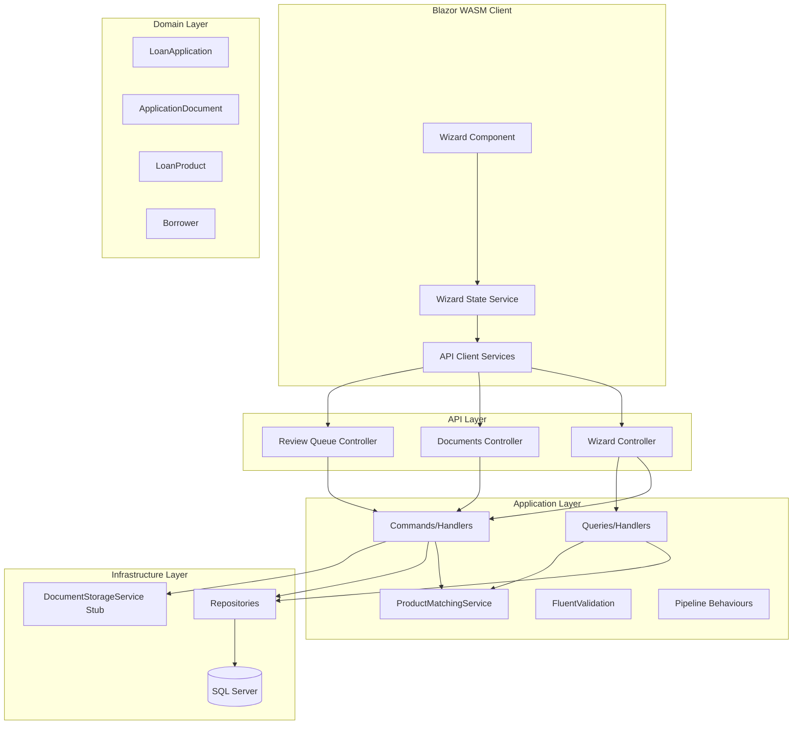
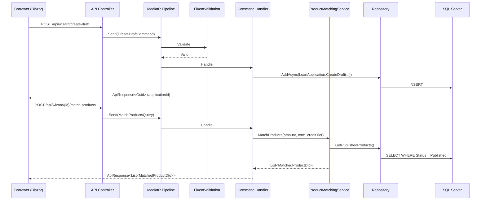
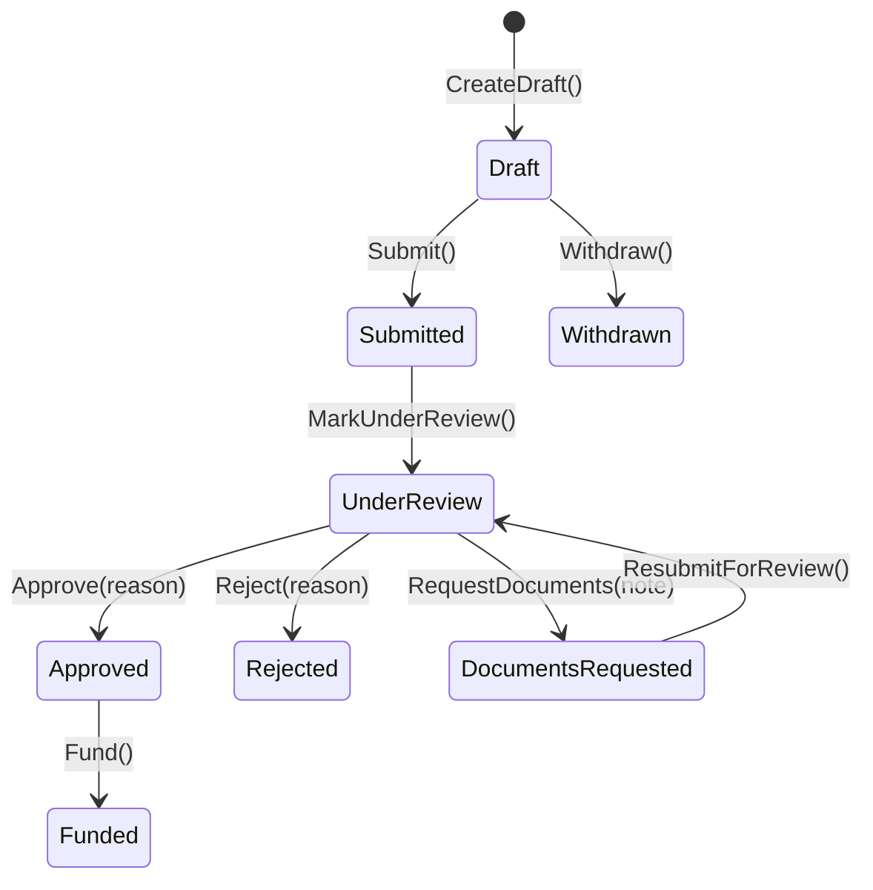

# Design Document: Loan Application Wizard

## Overview

The Loan Application Wizard enhances the existing `LoanApplication` flow into a guided multi-step process. Borrowers specify loan parameters, receive automatically matched products ranked by their credit tier, select a product, upload supporting documents, and submit for CRM review. CrmManagers then verify documents and approve or reject applications through a review queue.

This design extends the existing Clean Architecture layers:
- **Domain**: Enhanced `LoanApplication` entity with new states and properties; new `ApplicationDocument` entity
- **Application**: New `ProductMatchingService`, document management commands/queries, wizard-related CQRS handlers
- **Infrastructure**: Stub `IDocumentStorageService` implementation, new `IApplicationDocumentRepository`
- **API**: New endpoints for wizard flow, document upload, and CRM review queue
- **Blazor WASM**: Multi-step wizard component with client-side state management

### Key Design Decisions

1. **Client-side wizard state**: The wizard steps are managed entirely in the Blazor WASM client. The server only persists data when the user explicitly saves (advancing steps or submitting). This avoids server-side session complexity.
2. **Draft-first creation**: A `LoanApplication` is created in `Draft` status at Step 1, allowing partial saves and resume capability.
3. **Product matching as a service**: The `ProductMatchingService` lives in the Application layer as a pure query service with no side effects, making it highly testable.
4. **Stub document storage**: `IDocumentStorageService` is defined in Application and implemented as a local file-system stub in Infrastructure, ready for future cloud storage replacement.
5. **State machine enforcement in Domain**: All state transitions are validated within the `LoanApplication` entity, ensuring invariants regardless of the calling layer.

## Architecture



### Request Flow — Wizard Submission



## Components and Interfaces

### Domain Layer

#### Enhanced LoanApplication Entity

The existing `LoanApplication` entity is enhanced with:
- New state: `DocumentsRequested = 8` added to `LoanApplicationStatus` enum
- New properties: `ReviewedBy`, `ReviewReason`, `ReviewedAtUtc`
- New methods: `CreateDraft()` factory, `RequestDocuments()`, `ResubmitForReview()`, `Submit()`
- Modified methods: `Approve(string reason, string reviewedBy)`, `Reject(string reason, string reviewedBy)` now require reason and reviewer

```csharp
// Enhanced state transitions (enforced in domain)
// Draft → Submitted (via Submit())
// Draft → Withdrawn (via Withdraw())
// Submitted → UnderReview (via MarkUnderReview())
// UnderReview → Approved (via Approve())
// UnderReview → Rejected (via Reject())
// UnderReview → DocumentsRequested (via RequestDocuments())
// DocumentsRequested → UnderReview (via ResubmitForReview())
```

#### New ApplicationDocument Entity

```csharp
public sealed class ApplicationDocument : AuditableEntity
{
    public Guid LoanApplicationId { get; private set; }
    public DocumentType Type { get; private set; }
    public string FileName { get; private set; }
    public string StorageReference { get; private set; }
    public DateTime UploadedAtUtc { get; private set; }
    public DocumentStatus Status { get; private set; }
    public string? VerifiedBy { get; private set; }
    public DateTime? VerifiedAtUtc { get; private set; }
    public string? RejectionNote { get; private set; }
}
```

#### New Enums

```csharp
public enum DocumentType
{
    NationalID = 1,
    ProofOfIncome = 2,
    BankStatement = 3,
    AddressProof = 4,
    Other = 5
}

public enum DocumentStatus
{
    Pending = 1,
    Verified = 2,
    Rejected = 3
}
```

### Application Layer

#### IDocumentStorageService Interface

```csharp
public interface IDocumentStorageService
{
    Task<string> StoreAsync(Stream fileStream, string fileName, CancellationToken ct);
    Task<Stream> RetrieveAsync(string storageReference, CancellationToken ct);
    Task DeleteAsync(string storageReference, CancellationToken ct);
}
```

#### IApplicationDocumentRepository Interface

```csharp
public interface IApplicationDocumentRepository
{
    Task AddAsync(ApplicationDocument document, CancellationToken ct);
    Task<ApplicationDocument?> GetByIdAsync(Guid id, CancellationToken ct);
    Task<IReadOnlyList<ApplicationDocument>> GetByApplicationIdAsync(Guid applicationId, CancellationToken ct);
    Task SaveChangesAsync(CancellationToken ct);
}
```

#### ProductMatchingService

```csharp
public sealed class ProductMatchingService
{
    private readonly ILoanProductRepository _productRepository;

    public async Task<IReadOnlyList<MatchedProductDto>> MatchProductsAsync(
        decimal requestedAmount,
        int requestedTermMonths,
        CreditTier borrowerTier,
        CancellationToken ct)
    {
        // 1. Get all published products
        // 2. Filter: MinimumAmount <= requestedAmount <= MaximumAmount
        // 3. Filter: MinimumTermMonths <= requestedTermMonths <= MaximumTermMonths
        // 4. Calculate effective rate: base + tier adjustment (A=+0, B=+2, C=+4)
        // 5. Sort by effective rate ASC, then MaximumAmount DESC for ties
        // 6. Return MatchedProductDto list
    }
}
```

### CQRS Commands and Queries

| Handler | Type | Description |
|---------|------|-------------|
| `CreateDraftLoanApplicationCommand` | Command | Creates a LoanApplication in Draft status with purpose, amount, term |
| `UpdateDraftLoanApplicationCommand` | Command | Updates draft with product selection |
| `SubmitLoanApplicationCommand` | Command | Transitions Draft → Submitted, validates completeness |
| `WithdrawLoanApplicationCommand` | Command | Transitions Draft → Withdrawn |
| `UploadDocumentCommand` | Command | Stores file and creates ApplicationDocument |
| `RemoveDocumentCommand` | Command | Removes document from draft application |
| `VerifyDocumentCommand` | Command | CrmManager marks document Verified |
| `RejectDocumentCommand` | Command | CrmManager marks document Rejected with note |
| `RequestAdditionalDocumentsCommand` | Command | Transitions UnderReview → DocumentsRequested |
| `ResubmitForReviewCommand` | Command | Transitions DocumentsRequested → UnderReview |
| `ApproveLoanApplicationCommand` | Command | Enhanced: requires reason, transitions UnderReview → Approved |
| `RejectLoanApplicationCommand` | Command | Enhanced: requires reason, transitions UnderReview → Rejected |
| `MatchProductsQuery` | Query | Returns matched products for given criteria |
| `GetReviewQueueQuery` | Query | Returns applications in reviewable states |
| `GetApplicationDetailsQuery` | Query | Returns full application with documents |
| `GetBorrowerApplicationsQuery` | Query | Returns borrower's applications for dashboard |

### API Endpoints

| Method | Route | Auth Policy | Description |
|--------|-------|-------------|-------------|
| POST | `/api/wizard/create-draft` | Borrower role | Create draft application |
| PUT | `/api/wizard/{id}/parameters` | Borrower role | Update purpose/amount/term |
| POST | `/api/wizard/{id}/match-products` | Borrower role | Get matched products |
| PUT | `/api/wizard/{id}/select-product` | Borrower role | Associate product with draft |
| POST | `/api/wizard/{id}/documents` | Borrower role | Upload document (multipart) |
| DELETE | `/api/wizard/{id}/documents/{docId}` | Borrower role | Remove document |
| POST | `/api/wizard/{id}/submit` | Borrower role | Submit application |
| POST | `/api/wizard/{id}/withdraw` | Borrower role | Withdraw draft |
| POST | `/api/wizard/{id}/resubmit` | Borrower role | Resubmit after docs requested |
| GET | `/api/review-queue` | CanProcessApplications | List reviewable applications |
| GET | `/api/review-queue/{id}` | CanProcessApplications | Full application details |
| POST | `/api/review-queue/{id}/mark-under-review` | CanProcessApplications | Move to UnderReview |
| POST | `/api/review-queue/{id}/approve` | CanProcessApplications | Approve with reason |
| POST | `/api/review-queue/{id}/reject` | CanProcessApplications | Reject with reason |
| POST | `/api/review-queue/{id}/request-documents` | CanProcessApplications | Request additional docs |
| POST | `/api/review-queue/{id}/documents/{docId}/verify` | CanProcessApplications | Verify document |
| POST | `/api/review-queue/{id}/documents/{docId}/reject` | CanProcessApplications | Reject document with note |
| GET | `/api/borrower/applications` | Borrower role | Borrower dashboard list |

### Blazor WASM Components

#### WizardStateService (Client-side)

```csharp
public sealed class WizardStateService
{
    public Guid? ApplicationId { get; private set; }
    public int CurrentStep { get; private set; } = 1;
    public WizardFormModel FormModel { get; } = new();

    public void SetApplicationId(Guid id) { ... }
    public void GoToStep(int step) { ... }
    public void Reset() { ... }
}
```

#### Wizard Component Hierarchy

```
LoanApplicationWizard.razor
├── WizardStepIndicator.razor
├── Step1_LoanParameters.razor
├── Step2_ProductMatching.razor
├── Step3_ProductSelection.razor
├── Step4_DocumentUpload.razor
└── Step5_ReviewSubmit.razor
```

## Data Models

### Database Schema Changes

#### LoanApplications Table (Enhanced)

| Column | Type | Notes |
|--------|------|-------|
| `Purpose` | nvarchar(1000) | Already exists |
| `SubmittedAtUtc` | datetime2 | Already exists, nullable for drafts |
| `ReviewedBy` | nvarchar(450) | New — nullable, FK to AspNetUsers |
| `ReviewReason` | nvarchar(2000) | New — nullable |
| `ReviewedAtUtc` | datetime2 | New — nullable |
| `LoanProductId` | uniqueidentifier | Now nullable (not set until Step 3) |

#### ApplicationDocuments Table (New)

| Column | Type | Constraints |
|--------|------|-------------|
| `Id` | uniqueidentifier | PK |
| `LoanApplicationId` | uniqueidentifier | FK, NOT NULL |
| `Type` | int | NOT NULL (DocumentType enum) |
| `FileName` | nvarchar(500) | NOT NULL |
| `StorageReference` | nvarchar(1000) | NOT NULL |
| `UploadedAtUtc` | datetime2 | NOT NULL |
| `Status` | int | NOT NULL (DocumentStatus enum) |
| `VerifiedBy` | nvarchar(450) | Nullable |
| `VerifiedAtUtc` | datetime2 | Nullable |
| `RejectionNote` | nvarchar(2000) | Nullable |
| `CreatedAtUtc` | datetime2 | NOT NULL (from AuditableEntity) |
| `CreatedBy` | nvarchar(450) | Nullable |
| `UpdatedAtUtc` | datetime2 | Nullable |
| `UpdatedBy` | nvarchar(450) | Nullable |

### DTOs (Shared Layer)

```csharp
public sealed record MatchedProductDto(
    Guid ProductId,
    string Title,
    string LenderName,
    decimal EffectiveInterestRate,
    decimal MinimumAmount,
    decimal MaximumAmount,
    int MinimumTermMonths,
    int MaximumTermMonths);

public sealed record ApplicationDocumentDto(
    Guid Id,
    string FileName,
    DocumentType Type,
    DocumentStatus Status,
    DateTime UploadedAtUtc,
    string? VerifiedBy,
    DateTime? VerifiedAtUtc,
    string? RejectionNote);

public sealed record ReviewQueueItemDto(
    Guid ApplicationId,
    string BorrowerName,
    decimal RequestedAmount,
    string ProductTitle,
    DateTime SubmittedAtUtc,
    LoanApplicationStatus Status,
    int DocumentCount,
    int VerifiedDocumentCount);

public sealed record WizardApplicationSummaryDto(
    Guid ApplicationId,
    string? ProductTitle,
    decimal RequestedAmount,
    int TermMonths,
    DateTime? SubmittedAtUtc,
    LoanApplicationStatus Status,
    int MatchedProductCount,
    int UploadedDocuments,
    int VerifiedDocuments,
    int RejectedDocuments);
```

### State Machine Diagram




## Correctness Properties

*A property is a characteristic or behavior that should hold true across all valid executions of a system — essentially, a formal statement about what the system should do. Properties serve as the bridge between human-readable specifications and machine-verifiable correctness guarantees.*

### Property 1: Product Matching Invariant

*For any* valid requested amount, requested term, credit tier, and set of loan products (some published, some not), the `ProductMatchingService.MatchProductsAsync` result SHALL satisfy all of the following:
- Every returned product has `Status = Published`
- Every returned product's amount range contains the requested amount (`MinimumAmount <= requestedAmount <= MaximumAmount`)
- Every returned product's term range contains the requested term (`MinimumTermMonths <= requestedTermMonths <= MaximumTermMonths`)
- The results are sorted by effective interest rate in ascending order
- When two products have the same effective interest rate, they are sorted by maximum amount in descending order
- No published product that satisfies the amount and term filters is omitted from the results

**Validates: Requirements 2.1, 2.2, 2.3, 2.6, 15.2, 15.3, 15.5**

### Property 2: Credit Tier Rate Calculation

*For any* loan product with a base interest rate and *for any* credit tier, the effective interest rate SHALL equal:
- Tier A: base rate + 0 percentage points
- Tier B: base rate + 2 percentage points
- Tier C: base rate + 4 percentage points

**Validates: Requirements 15.1**

### Property 3: State Machine Transition Validity

*For any* `LoanApplication` in any valid state, and *for any* attempted state transition:
- If the transition is in the set {Draft→Submitted, Draft→Withdrawn, Submitted→UnderReview, UnderReview→Approved, UnderReview→Rejected, UnderReview→DocumentsRequested, DocumentsRequested→UnderReview}, the transition SHALL succeed and the resulting status SHALL equal the target state
- If the transition is NOT in the allowed set for the current state, the entity SHALL throw a `DomainException` and the status SHALL remain unchanged

**Validates: Requirements 6.1, 6.2, 6.3, 6.4, 9.4**

### Property 4: Document Verification Integrity

*For any* `ApplicationDocument` in `Pending` status:
- When verified with a valid CrmManager identifier, the status SHALL become `Verified`, `VerifiedBy` SHALL equal the CrmManager identifier, and `VerifiedAtUtc` SHALL be set to a non-null timestamp
- When rejected with a valid CrmManager identifier and a non-empty rejection note, the status SHALL become `Rejected`, `VerifiedBy` SHALL equal the CrmManager identifier, `VerifiedAtUtc` SHALL be set, and `RejectionNote` SHALL equal the provided note
- When rejected with an empty or null rejection note, the operation SHALL fail with a validation error

*For any* `ApplicationDocument` NOT in `Pending` status, verification or rejection attempts SHALL fail.

**Validates: Requirements 8.1, 8.2, 8.3**

### Property 5: Submission Completeness Validation

*For any* `LoanApplication` in Draft status, submission SHALL succeed if and only if:
- A `LoanProductId` is associated (not null/empty)
- At least one `ApplicationDocument` of type `NationalID` exists
- At least one `ApplicationDocument` of type `ProofOfIncome` exists
- At least one `ApplicationDocument` of type `BankStatement` exists

If any of these conditions are not met, submission SHALL be rejected with an error listing the specific missing items.

**Validates: Requirements 4.5, 5.2, 5.5**

### Property 6: Borrower Data Isolation

*For any* set of borrowers each with their own loan applications, when a borrower queries their applications, the result SHALL contain only applications where `BorrowerId` matches that borrower's identifier, and SHALL never include applications belonging to other borrowers.

**Validates: Requirements 12.1, 14.3, 14.5**

## Error Handling

### Domain Layer Errors

| Error Condition | Exception Type | Message Pattern |
|----------------|---------------|-----------------|
| Invalid state transition | `DomainException` | "Cannot transition from {current} to {target}." |
| Invalid amount (≤ 0) | `DomainException` | "Requested amount must be greater than zero." |
| Invalid term (≤ 0) | `DomainException` | "Term must be greater than zero." |
| Purpose too long (> 1000) | `DomainException` | "Loan purpose cannot exceed 1000 characters." |
| Document rejection without note | `DomainException` | "Rejection note is required." |
| Verify/reject non-pending document | `DomainException` | "Only pending documents can be verified/rejected." |

### Application Layer Errors

| Error Condition | Exception Type | HTTP Status |
|----------------|---------------|-------------|
| Validation failure (FluentValidation) | `ValidationException` | 400 Bad Request |
| Entity not found | `NotFoundException` | 404 Not Found |
| Unauthorized access | — | 401 Unauthorized |
| Forbidden (wrong role/ownership) | — | 403 Forbidden |
| Invalid document type | `ValidationException` | 400 Bad Request |
| Incomplete submission | `ValidationException` | 400 Bad Request |

### Infrastructure Layer Errors

| Error Condition | Handling Strategy |
|----------------|-------------------|
| File storage failure | Throw `InfrastructureException`, let global middleware handle |
| Database connection failure | EF Core retry policy (configured in DI) |
| Concurrency conflict | `DbUpdateConcurrencyException` → 409 Conflict |

### Global Error Handling

The existing `GlobalExceptionMiddleware` catches all unhandled exceptions and returns a consistent `ApiResponse<T>` with `Success = false`. Domain exceptions map to 400, not-found to 404, and unexpected errors to 500.

## Testing Strategy

### Property-Based Tests (FsCheck with xUnit)

The project will use **FsCheck.Xunit** for property-based testing in .NET. Each property test runs a minimum of 100 iterations with randomly generated inputs.

| Property | Test Class | Generators |
|----------|-----------|------------|
| Property 1: Product Matching Invariant | `ProductMatchingServicePropertyTests` | Random `LoanProduct` lists (varying amounts, terms, statuses), random `decimal` amounts, random `int` terms, random `CreditTier` |
| Property 2: Credit Tier Rate Calculation | `CreditTierRatePropertyTests` | Random `InterestRate` values, all three `CreditTier` values |
| Property 3: State Machine Transitions | `LoanApplicationStateMachinePropertyTests` | All `LoanApplicationStatus` values × all transition methods |
| Property 4: Document Verification Integrity | `DocumentVerificationPropertyTests` | Random `ApplicationDocument` in various statuses, random CrmManager IDs, random rejection notes |
| Property 5: Submission Completeness | `SubmissionCompletenessPropertyTests` | Random subsets of required document types, random nullable `LoanProductId` |
| Property 6: Borrower Data Isolation | `BorrowerDataIsolationPropertyTests` | Random sets of borrowers and applications with varying ownership |

**Configuration:**
- Minimum 100 iterations per property (`MaxTest = 100`)
- Each test tagged with: `// Feature: loan-application-wizard, Property {N}: {title}`
- Custom `Arbitrary<T>` generators for domain value objects (`Money`, `InterestRate`)

### Unit Tests (xUnit + FluentAssertions)

| Area | Focus |
|------|-------|
| `LoanApplication.CreateDraft()` | Verify Draft status, fields set correctly |
| `LoanApplication.Submit()` | Verify transition and timestamp |
| `ApplicationDocument.Create()` | Verify Pending status, all fields |
| `ProductMatchingService` | Specific examples: empty product list, single match, tie-breaking |
| FluentValidation validators | Boundary values, required fields |
| Command handlers | Happy path with mocked repositories |

### Integration Tests

| Area | Focus |
|------|-------|
| API endpoints | Authorization policies enforced correctly |
| Document upload | Multipart form data handling |
| Review queue queries | Correct filtering by status |
| EF Core repository | Correct SQL generation for filters |
| `IResourceFilteredQuery` pipeline | Borrower/Lender isolation |

### Test Project Structure

```
tests/
├── LoanSuperMarket.Domain.Tests/
│   ├── LoanApplicationStateMachinePropertyTests.cs
│   ├── DocumentVerificationPropertyTests.cs
│   └── LoanApplicationTests.cs
├── LoanSuperMarket.Application.Tests/
│   ├── ProductMatchingServicePropertyTests.cs
│   ├── CreditTierRatePropertyTests.cs
│   ├── SubmissionCompletenessPropertyTests.cs
│   ├── BorrowerDataIsolationPropertyTests.cs
│   └── Validators/
└── LoanSuperMarket.Api.Tests/
    ├── WizardControllerTests.cs
    ├── ReviewQueueControllerTests.cs
    └── AuthorizationTests.cs
```
