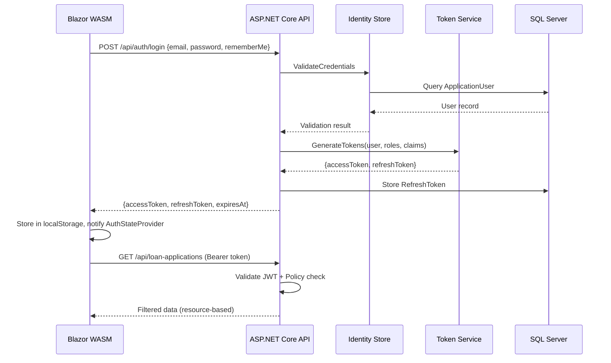
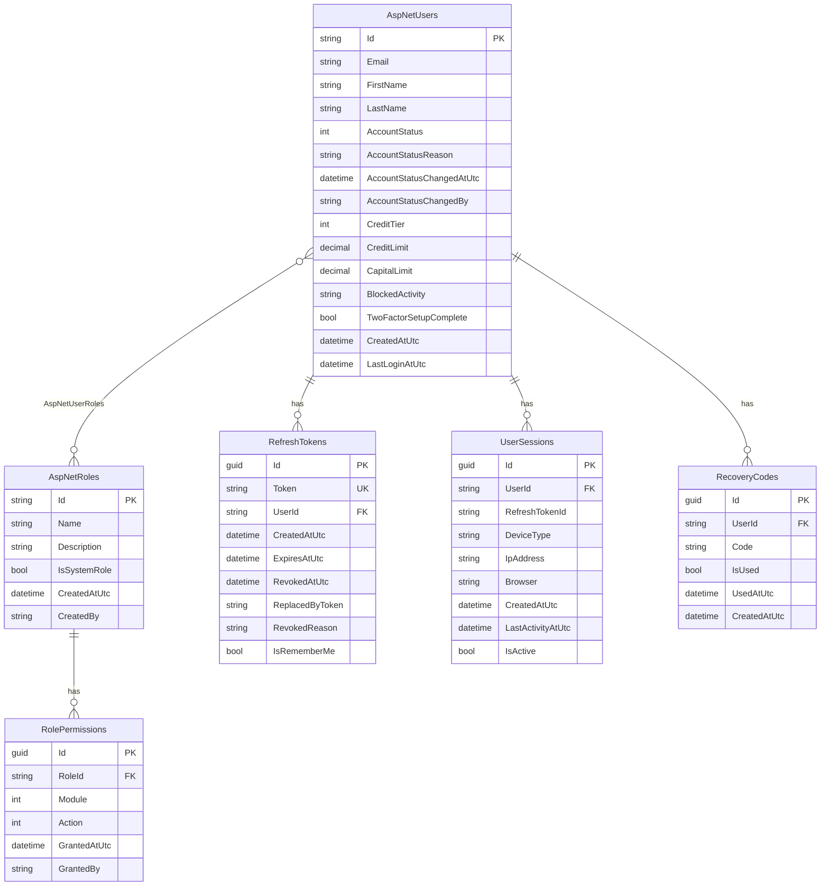

# Technical Design Document: User Roles & Authorization

## Overview

This design introduces a comprehensive authentication and authorization system into the Loan Investment Supermarket platform. The system integrates ASP.NET Core Identity with JWT-based token authentication, policy-based authorization, resource-based data isolation, and Blazor WebAssembly frontend integration.

**Key Design Decisions:**
- **ASP.NET Core Identity** as the user store (extends `IdentityDbContext` alongside existing `ApplicationDbContext`)
- **JWT Bearer tokens** for stateless API authentication with refresh token rotation
- **Policy-based authorization** mapping roles to named policies for centralized access control
- **Resource ownership filters** applied at the query level via `ICurrentUserService`
- **Custom `AuthenticationStateProvider`** in Blazor WASM reading JWT claims from localStorage
- **Separate `IdentityDbContext`** to keep Identity tables isolated from domain tables while sharing the same database

**Migration Strategy:** The existing `ApplicationDbContext` remains unchanged. A new `AuthIdentityDbContext` inheriting from `IdentityDbContext<ApplicationUser>` manages Identity tables. Both contexts target the same SQL Server database, allowing EF migrations to coexist.

---

## Architecture

### High-Level Authentication Flow



### Layer Responsibilities

```mermaid
graph TD
    A[Blazor WASM] -->|HTTP + Bearer Token| B[API Layer]
    B -->|MediatR Commands/Queries| C[Application Layer]
    C -->|Domain Logic| D[Domain Layer]
    C -->|Data Access| E[Infrastructure Layer]
    E -->|EF Core| F[SQL Server]

    subgraph "API Layer"
        B1[AuthController]
        B2[UserManagementController]
        B3[RoleController]
        B4[Existing Controllers + [Authorize]]
    end

    subgraph "Application Layer"
        C1[Auth Commands/Queries]
        C2[ITokenService]
        C3[ICurrentUserService]
        C4[IAuditLogger]
    end

    subgraph "Infrastructure Layer"
        E1[AuthIdentityDbContext]
        E2[JwtTokenService]
        E3[CurrentUserService]
        E4[IdentitySeeder]
    end
```

---

## Components and Interfaces

### Domain Layer Additions

#### New Entities

```csharp
// Domain/Entities/Identity/ApplicationUser.cs
public sealed class ApplicationUser : IdentityUser
{
    public string FirstName { get; set; } = string.Empty;
    public string LastName { get; set; } = string.Empty;
    public AccountStatus AccountStatus { get; set; } = AccountStatus.PendingApproval;
    public string? AccountStatusReason { get; set; }
    public DateTime? AccountStatusChangedAtUtc { get; set; }
    public string? AccountStatusChangedBy { get; set; }
    public CreditTier? CreditTier { get; set; }
    public decimal? CreditLimit { get; set; }
    public decimal? CapitalLimit { get; set; }
    public string? BlockedActivity { get; set; } // "Borrowing", "Lending", "Both"
    public bool TwoFactorSetupComplete { get; set; }
    public DateTime CreatedAtUtc { get; set; } = DateTime.UtcNow;
    public DateTime? LastLoginAtUtc { get; set; }
    public string FullName => $"{FirstName} {LastName}";

    // Navigation
    public ICollection<RefreshToken> RefreshTokens { get; set; } = [];
    public ICollection<UserSession> Sessions { get; set; } = [];
}
```

```csharp
// Domain/Entities/Identity/RefreshToken.cs
public sealed class RefreshToken : BaseEntity
{
    public string Token { get; set; } = string.Empty;
    public string UserId { get; set; } = string.Empty;
    public DateTime CreatedAtUtc { get; set; } = DateTime.UtcNow;
    public DateTime ExpiresAtUtc { get; set; }
    public DateTime? RevokedAtUtc { get; set; }
    public string? ReplacedByToken { get; set; }
    public string? RevokedReason { get; set; }
    public bool IsRememberMe { get; set; }
    public bool IsExpired => DateTime.UtcNow >= ExpiresAtUtc;
    public bool IsRevoked => RevokedAtUtc is not null;
    public bool IsActive => !IsExpired && !IsRevoked;

    // Navigation
    public ApplicationUser User { get; set; } = null!;
}
```

```csharp
// Domain/Entities/Identity/UserSession.cs
public sealed class UserSession : BaseEntity
{
    public string UserId { get; set; } = string.Empty;
    public string RefreshTokenId { get; set; } = string.Empty;
    public string? DeviceType { get; set; }
    public string? IpAddress { get; set; }
    public string? Browser { get; set; }
    public DateTime CreatedAtUtc { get; set; } = DateTime.UtcNow;
    public DateTime LastActivityAtUtc { get; set; } = DateTime.UtcNow;
    public bool IsActive { get; set; } = true;

    // Navigation
    public ApplicationUser User { get; set; } = null!;
}
```

```csharp
// Domain/Entities/Identity/CustomRole.cs
public sealed class CustomRole : IdentityRole
{
    public string? Description { get; set; }
    public bool IsSystemRole { get; set; }
    public DateTime CreatedAtUtc { get; set; } = DateTime.UtcNow;
    public string? CreatedBy { get; set; }

    // Navigation
    public ICollection<RolePermission> Permissions { get; set; } = [];
}
```

```csharp
// Domain/Entities/Identity/RolePermission.cs
public sealed class RolePermission : BaseEntity
{
    public string RoleId { get; set; } = string.Empty;
    public PermissionModule Module { get; set; }
    public PermissionAction Action { get; set; }
    public DateTime GrantedAtUtc { get; set; } = DateTime.UtcNow;
    public string? GrantedBy { get; set; }

    // Navigation
    public CustomRole Role { get; set; } = null!;
}
```

```csharp
// Domain/Entities/Identity/RecoveryCode.cs
public sealed class RecoveryCode : BaseEntity
{
    public string UserId { get; set; } = string.Empty;
    public string Code { get; set; } = string.Empty;
    public bool IsUsed { get; set; }
    public DateTime? UsedAtUtc { get; set; }
    public DateTime CreatedAtUtc { get; set; } = DateTime.UtcNow;
}
```

#### New Enums

```csharp
// Domain/Enums/AccountStatus.cs
public enum AccountStatus
{
    PendingApproval,
    Active,
    Hold,
    Blocked,
    Suspended,
    Closed,
    DocumentsRequested
}

// Domain/Enums/CreditTier.cs
public enum CreditTier
{
    A, // Excellent: 10-11% interest, high limits
    B, // Good: 12-13% interest, medium limits
    C  // Fair: 14-15% interest, lower limits
}

// Domain/Enums/PermissionModule.cs
public enum PermissionModule
{
    UserManagement,
    LoanManagement,
    ProductManagement,
    FinancialOperations,
    Reports,
    SystemSettings,
    Messaging
}

// Domain/Enums/PermissionAction.cs
public enum PermissionAction
{
    View,
    Create,
    Edit,
    Delete,
    Approve
}
```

### Application Layer Interfaces

```csharp
// Application/Common/Interfaces/ITokenService.cs
public interface ITokenService
{
    Task<AuthTokenResponse> GenerateTokensAsync(ApplicationUser user, bool rememberMe = false);
    Task<AuthTokenResponse> RefreshTokenAsync(string refreshToken);
    Task RevokeTokenAsync(string refreshToken, string reason);
    Task RevokeAllUserTokensAsync(string userId, string reason);
}

// Application/Common/Interfaces/ICurrentUserService.cs
public interface ICurrentUserService
{
    string? UserId { get; }
    string? Email { get; }
    IReadOnlyList<string> Roles { get; }
    bool IsAuthenticated { get; }
    bool IsInRole(string role);
    bool HasPermission(PermissionModule module, PermissionAction action);
}

// Application/Common/Interfaces/IIdentityService.cs
public interface IIdentityService
{
    Task<(bool Succeeded, string UserId, IEnumerable<string> Errors)> RegisterUserAsync(
        RegisterUserRequest request);
    Task<bool> ValidateCredentialsAsync(string email, string password);
    Task<ApplicationUser?> GetUserByEmailAsync(string email);
    Task<ApplicationUser?> GetUserByIdAsync(string userId);
    Task<IReadOnlyList<string>> GetUserRolesAsync(string userId);
    Task<bool> AssignRoleAsync(string userId, string roleName);
    Task<bool> RemoveRoleAsync(string userId, string roleName);
    Task<bool> IsEmailConfirmedAsync(string userId);
    Task<string> GenerateEmailConfirmationTokenAsync(string userId);
    Task<bool> ConfirmEmailAsync(string userId, string token);
    Task<string> GeneratePasswordResetTokenAsync(string email);
    Task<bool> ResetPasswordAsync(string email, string token, string newPassword);
    Task<bool> ChangePasswordAsync(string userId, string currentPassword, string newPassword);
}

// Application/Common/Interfaces/ITwoFactorService.cs
public interface ITwoFactorService
{
    Task<TwoFactorSetupResponse> GenerateSetupAsync(string userId);
    Task<bool> VerifyCodeAsync(string userId, string code);
    Task<IReadOnlyList<string>> GenerateRecoveryCodesAsync(string userId);
    Task<bool> ValidateRecoveryCodeAsync(string userId, string code);
    Task EnableAsync(string userId);
    Task DisableAsync(string userId);
}

// Application/Common/Interfaces/ISessionService.cs
public interface ISessionService
{
    Task<UserSession> CreateSessionAsync(string userId, string refreshTokenId, SessionInfo info);
    Task<IReadOnlyList<UserSessionDto>> GetUserSessionsAsync(string userId);
    Task RevokeSessionAsync(Guid sessionId, string userId);
    Task RevokeAllSessionsAsync(string userId, Guid? exceptSessionId = null);
    Task UpdateActivityAsync(Guid sessionId);
}
```

### Application Layer CQRS Commands and Queries

```csharp
// Auth Feature Commands
public record RegisterCommand(string Email, string Password, string FirstName, 
    string LastName, string UserType, string? CompanyName) : IRequest<ApiResponse<string>>;

public record LoginCommand(string Email, string Password, bool RememberMe, 
    string? TotpCode) : IRequest<ApiResponse<AuthTokenResponse>>;

public record RefreshTokenCommand(string RefreshToken) : IRequest<ApiResponse<AuthTokenResponse>>;

public record LogoutCommand(string RefreshToken) : IRequest<ApiResponse<string>>;

public record ForgotPasswordCommand(string Email) : IRequest<ApiResponse<string>>;

public record ResetPasswordCommand(string Email, string Token, 
    string NewPassword) : IRequest<ApiResponse<string>>;

public record ConfirmEmailCommand(string UserId, string Token) : IRequest<ApiResponse<string>>;

// Two-Factor Commands
public record Setup2FaCommand(string UserId) : IRequest<ApiResponse<TwoFactorSetupResponse>>;
public record Verify2FaCommand(string UserId, string Code) : IRequest<ApiResponse<IReadOnlyList<string>>>;
public record Disable2FaCommand(string UserId) : IRequest<ApiResponse<string>>;

// User Management Commands
public record CreateUserCommand(string Email, string Password, string FirstName,
    string LastName, IReadOnlyList<string> Roles) : IRequest<ApiResponse<string>>;

public record UpdateUserCommand(string UserId, string FirstName, string LastName,
    IReadOnlyList<string> Roles) : IRequest<ApiResponse<string>>;

public record ChangeAccountStatusCommand(string UserId, AccountStatus NewStatus,
    string Reason, string? BlockedActivity) : IRequest<ApiResponse<string>>;

public record AssignRoleCommand(string UserId, string RoleName) : IRequest<ApiResponse<string>>;
public record RemoveRoleCommand(string UserId, string RoleName) : IRequest<ApiResponse<string>>;

// Vetting Workflow Commands
public record ApproveRegistrationCommand(string UserId, string Reason, 
    CreditTier? CreditTier, decimal? CreditLimit, 
    decimal? CapitalLimit) : IRequest<ApiResponse<string>>;

public record RejectRegistrationCommand(string UserId, string Reason) : IRequest<ApiResponse<string>>;

public record RequestDocumentsCommand(string UserId, 
    IReadOnlyList<string> RequiredDocuments) : IRequest<ApiResponse<string>>;

// Credit/Limits Commands
public record SetCreditTierCommand(string BorrowerUserId, CreditTier Tier, 
    string Justification) : IRequest<ApiResponse<string>>;

public record SetCreditLimitCommand(string UserId, decimal Limit, 
    string Justification) : IRequest<ApiResponse<string>>;

public record SetCapitalLimitCommand(string UserId, decimal Limit, 
    string Justification) : IRequest<ApiResponse<string>>;

// Custom Role Commands
public record CreateCustomRoleCommand(string Name, string Description,
    IReadOnlyList<PermissionDto> Permissions) : IRequest<ApiResponse<string>>;

public record UpdateCustomRoleCommand(string RoleId, string Description,
    IReadOnlyList<PermissionDto> Permissions) : IRequest<ApiResponse<string>>;

public record DeleteCustomRoleCommand(string RoleId) : IRequest<ApiResponse<string>>;

// Session Commands
public record RevokeSessionCommand(Guid SessionId) : IRequest<ApiResponse<string>>;
public record RevokeAllSessionsCommand(string UserId) : IRequest<ApiResponse<string>>;
```

```csharp
// Queries
public record GetUsersQuery(int Page, int PageSize, string? SearchTerm, 
    string? RoleFilter) : IRequest<PagedResult<UserDto>>;

public record GetUserByIdQuery(string UserId) : IRequest<UserDetailDto?>;

public record GetVettingQueueQuery(int Page, int PageSize) : IRequest<PagedResult<VettingItemDto>>;

public record GetUserSessionsQuery(string UserId) : IRequest<IReadOnlyList<UserSessionDto>>;

public record GetRolesQuery() : IRequest<IReadOnlyList<RoleDto>>;

public record GetRolePermissionsQuery(string RoleId) : IRequest<IReadOnlyList<PermissionDto>>;

public record SimulatePermissionsQuery(string UserId) : IRequest<PermissionSimulationResult>;

public record GetCurrentUserQuery() : IRequest<CurrentUserDto>;
```

### API Layer Controllers

```csharp
// Controllers/AuthController.cs
[ApiController]
[Route("api/auth")]
public sealed class AuthController : ControllerBase
{
    [HttpPost("register")]          // RegisterCommand
    [HttpPost("login")]             // LoginCommand
    [HttpPost("refresh-token")]     // RefreshTokenCommand
    [HttpPost("logout")]            // LogoutCommand [Authorize]
    [HttpPost("forgot-password")]   // ForgotPasswordCommand
    [HttpPost("reset-password")]    // ResetPasswordCommand
    [HttpPost("confirm-email")]     // ConfirmEmailCommand
    [HttpPost("2fa/setup")]         // Setup2FaCommand [Authorize]
    [HttpPost("2fa/verify")]        // Verify2FaCommand [Authorize]
    [HttpPost("2fa/disable")]       // Disable2FaCommand [Authorize]
}

// Controllers/UserManagementController.cs
[ApiController]
[Route("api/users")]
[Authorize(Policy = "CanManageUsers")]
public sealed class UserManagementController : ControllerBase
{
    [HttpGet]                       // GetUsersQuery
    [HttpGet("{id}")]               // GetUserByIdQuery
    [HttpPost]                      // CreateUserCommand
    [HttpPut("{id}")]               // UpdateUserCommand
    [HttpPost("{id}/status")]       // ChangeAccountStatusCommand
    [HttpPost("{id}/assign-role")]  // AssignRoleCommand
    [HttpPost("{id}/remove-role")]  // RemoveRoleCommand
    [HttpGet("{id}/sessions")]      // GetUserSessionsQuery
    [HttpPost("{id}/sessions/{sessionId}/revoke")] // RevokeSessionCommand
}

// Controllers/VettingController.cs
[ApiController]
[Route("api/vetting")]
[Authorize(Policy = "CanVetUsers")]
public sealed class VettingController : ControllerBase
{
    [HttpGet("queue")]              // GetVettingQueueQuery
    [HttpPost("{id}/approve")]      // ApproveRegistrationCommand
    [HttpPost("{id}/reject")]       // RejectRegistrationCommand
    [HttpPost("{id}/request-docs")] // RequestDocumentsCommand
}

// Controllers/RoleController.cs
[ApiController]
[Route("api/roles")]
[Authorize(Policy = "CanManageUsers")]
public sealed class RoleController : ControllerBase
{
    [HttpGet]                       // GetRolesQuery
    [HttpGet("{id}/permissions")]   // GetRolePermissionsQuery
    [HttpPost]                      // CreateCustomRoleCommand
    [HttpPut("{id}")]               // UpdateCustomRoleCommand
    [HttpDelete("{id}")]            // DeleteCustomRoleCommand
    [HttpPost("simulate/{userId}")] // SimulatePermissionsQuery
}

// Controllers/CreditController.cs
[ApiController]
[Route("api/credit")]
[Authorize(Policy = "CanSetLimits")]
public sealed class CreditController : ControllerBase
{
    [HttpPost("{userId}/tier")]     // SetCreditTierCommand
    [HttpPost("{userId}/credit-limit")]  // SetCreditLimitCommand
    [HttpPost("{userId}/capital-limit")] // SetCapitalLimitCommand
}

// Controllers/SessionController.cs
[ApiController]
[Route("api/sessions")]
[Authorize]
public sealed class SessionController : ControllerBase
{
    [HttpGet("my")]                 // GetUserSessionsQuery (current user)
    [HttpPost("{id}/revoke")]       // RevokeSessionCommand
}
```

### Infrastructure Layer Services

```csharp
// Infrastructure/Identity/AuthIdentityDbContext.cs
public sealed class AuthIdentityDbContext : IdentityDbContext<ApplicationUser, CustomRole, string>
{
    public DbSet<RefreshToken> RefreshTokens => Set<RefreshToken>();
    public DbSet<UserSession> UserSessions => Set<UserSession>();
    public DbSet<RolePermission> RolePermissions => Set<RolePermission>();
    public DbSet<RecoveryCode> RecoveryCodes => Set<RecoveryCode>();
}

// Infrastructure/Identity/JwtTokenService.cs (implements ITokenService)
// - Generates JWT with user claims, roles, permissions
// - Manages refresh token rotation with reuse detection
// - Configurable expiration via JwtSettings

// Infrastructure/Identity/CurrentUserService.cs (implements ICurrentUserService)
// - Reads claims from HttpContext.User
// - Exposes UserId, Email, Roles, Permissions

// Infrastructure/Identity/IdentitySeeder.cs
// - Seeds predefined roles on startup
// - Creates default Admin account from appsettings
// - Associates roles with policy claims

// Infrastructure/Identity/TwoFactorService.cs (implements ITwoFactorService)
// - TOTP secret generation and QR code URI
// - Code verification via Identity's built-in TOTP validator
// - Recovery code management
```

### Blazor WASM Layer

```csharp
// Services/Auth/JwtAuthenticationStateProvider.cs
public sealed class JwtAuthenticationStateProvider : AuthenticationStateProvider
{
    // Reads JWT from localStorage
    // Parses claims to build ClaimsPrincipal
    // Monitors token expiration, triggers refresh 2 min before expiry
    // Notifies subscribers on auth state changes
}

// Services/Auth/AuthApiClient.cs
public sealed class AuthApiClient
{
    Task<ApiResponse<AuthTokenResponse>> LoginAsync(LoginRequest request);
    Task<ApiResponse<AuthTokenResponse>> RefreshTokenAsync(string refreshToken);
    Task<ApiResponse<string>> RegisterAsync(RegisterRequest request);
    Task LogoutAsync();
    Task<ApiResponse<string>> ForgotPasswordAsync(string email);
    Task<ApiResponse<string>> ResetPasswordAsync(ResetPasswordRequest request);
}

// Services/Auth/AuthTokenHandler.cs (DelegatingHandler)
// - Attaches Bearer token to all outgoing requests
// - Intercepts 401 responses, attempts token refresh
// - Redirects to login on refresh failure

// Pages/Auth/Login.razor
// Pages/Auth/Register.razor
// Pages/Auth/ForgotPassword.razor
// Pages/Auth/ResetPassword.razor
// Pages/Auth/TwoFactorSetup.razor
// Pages/Auth/TwoFactorVerify.razor
// Pages/Account/Sessions.razor
// Pages/Admin/UserManagement.razor
// Pages/Admin/VettingQueue.razor
// Pages/Admin/RoleManagement.razor
```

### Policy Configuration

```csharp
// Infrastructure/Identity/AuthorizationPolicies.cs
public static class AuthorizationPolicies
{
    public static void Configure(AuthorizationOptions options)
    {
        options.AddPolicy("CanManageUsers", p => p.RequireRole("Admin"));
        options.AddPolicy("CanProcessApplications", p => p.RequireRole("Admin", "CrmManager"));
        options.AddPolicy("CanManageProducts", p => p.RequireRole("Admin", "CrmManager", "Lender"));
        options.AddPolicy("CanViewReports", p => p.RequireRole("Admin", "Auditor"));
        options.AddPolicy("CanManageLenders", p => p.RequireRole("Admin"));
        options.AddPolicy("CanManageBorrowers", p => p.RequireRole("Admin", "CrmManager"));
        options.AddPolicy("CanVetUsers", p => p.RequireRole("CrmManager"));
        options.AddPolicy("CanApproveProducts", p => p.RequireRole("CrmManager", "Admin"));
        options.AddPolicy("CanHandleDisputes", p => p.RequireRole("CustomerService", "Admin"));
        options.AddPolicy("CanManageMessages", p => p.RequireRole("CustomerService", "Admin"));
        options.AddPolicy("CanSetLimits", p => p.RequireRole("CrmManager", "Admin"));
        options.AddPolicy("CanApproveDisbursements", p => p.RequireRole("Admin"));
    }
}
```

### Resource-Based Authorization Filter

```csharp
// Application/Common/Behaviours/ResourceAuthorizationBehaviour.cs
// MediatR pipeline behaviour that:
// 1. Detects if the query implements IResourceFilteredQuery
// 2. Reads current user's roles from ICurrentUserService
// 3. If user is Borrower-only: injects BorrowerId filter
// 4. If user is Lender-only: injects LenderId filter
// 5. If user is Admin/CrmManager/Auditor: no filter applied

public interface IResourceFilteredQuery
{
    string? FilterByUserId { get; set; }
    string? FilterByRole { get; set; }
}
```

---

## Data Models

### Database Schema (Identity Tables)



### Existing Domain Table Relationships

The `Borrower` and `Lender` entities gain a nullable `UserId` column linking to `AspNetUsers.Id`. This enables resource-based authorization:

```csharp
// Added to existing entities
public class Borrower : AuditableEntity
{
    // ... existing properties
    public string? UserId { get; private set; } // FK to ApplicationUser
}

public class Lender : AuditableEntity
{
    // ... existing properties
    public string? UserId { get; private set; } // FK to ApplicationUser
}
```

### JWT Token Payload Structure

```json
{
  "sub": "user-guid",
  "email": "user@example.com",
  "given_name": "Afzal",
  "family_name": "Ahmed",
  "roles": ["Admin", "CrmManager"],
  "permissions": ["UserManagement.View", "UserManagement.Create"],
  "account_status": "Active",
  "iss": "LoanSuperMarket.Api",
  "aud": "LoanSuperMarket.Blazor",
  "exp": 1700000000,
  "iat": 1699999100
}
```

### Configuration Model

```csharp
// Shared/Configuration/JwtSettings.cs
public sealed class JwtSettings
{
    public string SecretKey { get; set; } = string.Empty;  // Min 256 bits
    public string Issuer { get; set; } = string.Empty;
    public string Audience { get; set; } = string.Empty;
    public int AccessTokenExpirationMinutes { get; set; } = 15;
    public int RefreshTokenExpirationDays { get; set; } = 7;
    public int RememberMeRefreshTokenExpirationDays { get; set; } = 30;
}

// appsettings.json additions
{
  "JwtSettings": {
    "SecretKey": "YourSuperSecretKeyThatIsAtLeast256BitsLong!@#$%",
    "Issuer": "LoanSuperMarket.Api",
    "Audience": "LoanSuperMarket.Blazor",
    "AccessTokenExpirationMinutes": 15,
    "RefreshTokenExpirationDays": 7,
    "RememberMeRefreshTokenExpirationDays": 30
  },
  "AdminSeed": {
    "Email": "admin@loansupermarket.com",
    "Password": "Admin@123456!"
  },
  "AccountSettings": {
    "MaxFailedLoginAttempts": 5,
    "LockoutDurationMinutes": 15,
    "MaxActiveLoansPerBorrower": 5,
    "SessionInactivityTimeoutMinutes": 30
  }
}
```

---

## Correctness Properties

*A property is a characteristic or behavior that should hold true across all valid executions of a system — essentially, a formal statement about what the system should do. Properties serve as the bridge between human-readable specifications and machine-verifiable correctness guarantees.*

### Property 1: Password Validation Correctness

*For any* string, the password validator SHALL accept it if and only if it contains at least 8 characters, at least one uppercase letter, at least one lowercase letter, at least one digit, and at least one special character. All strings not meeting every rule SHALL be rejected with appropriate error messages.

**Validates: Requirements 1.3, 1.4**

### Property 2: Token Claims Completeness

*For any* valid user with any combination of assigned roles, when a login succeeds the issued JWT Access_Token SHALL contain the user identifier, email, all assigned role names, and all policy claims associated with those roles.

**Validates: Requirements 2.1, 2.2**

### Property 3: Credential Error Message Uniformity

*For any* invalid login attempt (wrong email, wrong password, or both), the Auth_System SHALL return the same generic error message regardless of which credential was incorrect, preventing information leakage about registered accounts.

**Validates: Requirements 2.5**

### Property 4: Failed Login Counter Increment

*For any* sequence of N consecutive failed login attempts (where N < lockout threshold) against a valid account, the failed attempt counter SHALL equal N.

**Validates: Requirements 3.1**

### Property 5: Locked Account Rejects All Login

*For any* locked account, all login attempts SHALL be rejected regardless of whether the provided credentials are valid, until the lockout duration expires.

**Validates: Requirements 3.2, 3.3**

### Property 6: Refresh Token Rotation Invalidates Previous

*For any* valid refresh token, when it is used to obtain new tokens, the Token_Service SHALL issue a new Access_Token and a new Refresh_Token, and the previous Refresh_Token SHALL be marked as revoked and no longer usable.

**Validates: Requirements 4.1**

### Property 7: Refresh Token Reuse Detection

*For any* refresh token that has been previously revoked (used or explicitly invalidated), if it is presented again for refresh, the Token_Service SHALL reject the request AND invalidate all active refresh tokens for that user.

**Validates: Requirements 4.3**

### Property 8: Refreshed Token Reflects Current Roles

*For any* user whose roles have been modified since their last token issuance, when a token refresh occurs the new Access_Token SHALL contain the updated set of roles and claims, not the stale ones from the original token.

**Validates: Requirements 4.5**

### Property 9: Password Reset Prevents Email Enumeration

*For any* email address (registered or unregistered), the password reset endpoint SHALL return an identical success response structure, making it impossible for a caller to determine whether the email exists in the system.

**Validates: Requirements 5.2**

### Property 10: Role Assignment Round-Trip

*For any* user and any valid role, assigning the role then querying the user's roles SHALL include that role, and subsequently removing the role then querying SHALL no longer include it. A user SHALL be able to hold any combination of multiple roles simultaneously.

**Validates: Requirements 7.1, 7.2, 7.3**

### Property 11: Non-Admin Role Management Rejected

*For any* authenticated user who does not hold the Admin role, all attempts to assign or remove roles from any user SHALL be rejected with a 403 Forbidden response.

**Validates: Requirements 7.5**

### Property 12: Policy-Based Endpoint Authorization

*For any* protected API endpoint and any authenticated user, the Authorization_Engine SHALL grant access if and only if the user holds at least one role listed in the endpoint's policy. Users without a matching role SHALL receive a 403 Forbidden response; unauthenticated requests SHALL receive a 401 Unauthorized response.

**Validates: Requirements 8.1, 8.2, 8.3, 8.4, 8.5, 8.6, 8.7, 8.8, 8.9, 8.10, 8.11, 8.12, 8.13, 8.14**

### Property 13: Resource-Based Data Isolation

*For any* query returning loan applications or loan products, when the requesting user holds only the Borrower role the results SHALL contain exclusively their own resources, when the user holds only the Lender role the results SHALL contain exclusively their own products and applications against their products, and when the user holds Admin, CrmManager, or Auditor role the results SHALL contain all resources without ownership filtering.

**Validates: Requirements 9.1, 9.2, 9.3, 9.4**

### Property 14: Token Validation Rejects Tampered Tokens

*For any* JWT token, if the signature is invalid, the expiration has passed, or the issuer/audience claims do not match the configured values, the Auth_System SHALL reject the token and deny access to protected resources.

**Validates: Requirements 17.2, 17.3**

### Property 15: Account Status Enforcement

*For any* user account, the system SHALL enforce access restrictions based on the current Account_Status: PendingApproval users can only view their profile, Hold users cannot create new loans/products but can access existing ones, Blocked users cannot perform the specified blocked activity, Suspended users are denied all API access, and Closed users are denied all authentication attempts.

**Validates: Requirements 18.2, 18.3, 18.4, 18.5, 19.1, 19.2, 19.3, 19.4, 19.5, 20.1, 20.2**

### Property 16: Credit Limit Enforcement

*For any* Borrower with an assigned credit limit, loan applications that would cause total outstanding loan amounts to exceed the credit limit SHALL be rejected. *For any* Lender with an assigned capital limit, loan product funding that would cause total outstanding lending to exceed the capital limit SHALL be rejected. Applications and products within limits SHALL be accepted.

**Validates: Requirements 19.3, 19.4, 19.5, 19.6, 21.3, 21.4, 21.5, 21.6**

### Property 17: TOTP Verification Correctness

*For any* user with Two_Factor_Auth enabled, a valid TOTP code (computed from the shared secret for the current time window) SHALL be accepted, and any invalid code (wrong digits, expired window, previously used recovery code) SHALL be rejected.

**Validates: Requirements 21.2, 21.3, 21.4, 22.1, 22.3, 22.4**

### Property 18: Permission Union Across Multiple Roles

*For any* user holding multiple roles (predefined or custom), the effective permission set SHALL be the union of all permissions from all assigned roles. If any single assigned role grants a specific permission-action combination, the user SHALL have that permission regardless of other roles' restrictions.

**Validates: Requirements 22.4, 22.6, 23.4, 23.8**

### Property 19: Session Revocation Invalidates Tokens

*For any* active user session, when the session is revoked the associated Refresh_Token SHALL be immediately invalidated, and any subsequent attempt to use that Refresh_Token for token refresh SHALL be rejected.

**Validates: Requirements 23.4, 23.5, 24.4, 24.6**

### Property 20: Remember Me Token Expiration Extension

*For any* login with "Remember Me" selected, the issued Refresh_Token SHALL have a 30-day expiration. *For any* login without "Remember Me", the issued Refresh_Token SHALL have a 7-day expiration. Subsequent token refreshes SHALL maintain the original expiration policy.

**Validates: Requirements 24.1, 24.2, 24.4**

---

## Error Handling

### Authentication Errors

| Scenario | HTTP Status | Error Code | User-Facing Message |
|----------|-------------|------------|---------------------|
| Invalid credentials | 401 | `AUTH_INVALID_CREDENTIALS` | "Invalid email or password." |
| Account locked | 401 | `AUTH_ACCOUNT_LOCKED` | "Account temporarily locked. Try again in {minutes} minutes." |
| Account disabled/suspended | 403 | `AUTH_ACCOUNT_SUSPENDED` | "Your account has been suspended. Contact support." |
| Account closed | 401 | `AUTH_ACCOUNT_CLOSED` | "This account has been permanently closed." |
| Account pending approval | 403 | `AUTH_PENDING_APPROVAL` | "Your account is pending approval." |
| Email not verified | 401 | `AUTH_EMAIL_NOT_VERIFIED` | "Please verify your email address." |
| 2FA required | 401 | `AUTH_2FA_REQUIRED` | "Two-factor authentication code required." |
| Invalid 2FA code | 401 | `AUTH_INVALID_2FA` | "Invalid verification code." |
| Expired refresh token | 401 | `AUTH_TOKEN_EXPIRED` | "Session expired. Please log in again." |
| Token reuse detected | 401 | `AUTH_TOKEN_REUSE` | "Security alert: session invalidated." |

### Authorization Errors

| Scenario | HTTP Status | Error Code | User-Facing Message |
|----------|-------------|------------|---------------------|
| Missing authentication | 401 | `AUTHZ_UNAUTHENTICATED` | "Authentication required." |
| Insufficient permissions | 403 | `AUTHZ_FORBIDDEN` | "You do not have permission to perform this action." |
| Resource not owned | 403 | `AUTHZ_RESOURCE_FORBIDDEN` | "Access denied to this resource." |
| Credit limit exceeded | 400 | `LIMIT_CREDIT_EXCEEDED` | "This application would exceed your credit limit." |
| Capital limit exceeded | 400 | `LIMIT_CAPITAL_EXCEEDED` | "This would exceed your capital limit." |
| Max active loans reached | 400 | `LIMIT_MAX_LOANS` | "Maximum active loans limit reached." |

### Error Response Format

All auth errors follow the existing `ApiResponse<T>` pattern:

```csharp
// Consistent with existing pattern
ApiResponse<T>.Fail("Error message", new[] { "Detailed error 1", "Detailed error 2" });
```

### Retry and Recovery Strategy

- **Token refresh failures**: Blazor client retries once, then redirects to login
- **Network errors during auth**: Client shows toast notification, preserves form state
- **Lockout**: Client displays countdown timer, disables login form
- **2FA failures**: Allow up to 3 attempts before requiring full re-authentication

---

## Testing Strategy

### Property-Based Testing

**Library:** [FsCheck.Xunit](https://github.com/fscheck/FsCheck) (mature .NET PBT library with xUnit integration)

**Configuration:** Minimum 100 iterations per property test.

**Tag format:** Each property test is tagged with a comment:
```csharp
// Feature: user-roles-authorization, Property {N}: {property_text}
```

**Properties to implement as PBT:**

| Property | Test Focus | Generator Strategy |
|----------|-----------|-------------------|
| 1: Password Validation | PasswordValidator | Generate random strings; classify as valid/invalid based on rules |
| 2: Token Claims | JwtTokenService | Generate users with random role subsets; verify claim presence |
| 3: Error Uniformity | LoginHandler | Generate invalid credentials (wrong email/password); verify same response |
| 4: Counter Increment | AccountLockout | Generate random N (1-4) failed attempts; verify counter |
| 5: Locked Rejects | AccountLockout | Lock account; generate valid/invalid credentials; verify all rejected |
| 6: Token Rotation | RefreshTokenService | Generate valid tokens; refresh; verify old invalidated |
| 7: Reuse Detection | RefreshTokenService | Revoke token; attempt reuse; verify cascade revocation |
| 8: Role Change Reflection | RefreshTokenService | Modify roles; refresh; verify new claims |
| 9: Email Enumeration | PasswordResetHandler | Generate registered/unregistered emails; verify identical responses |
| 10: Role Round-Trip | RoleManagement | Generate role subsets; assign/remove; verify state |
| 11: Non-Admin Rejected | Authorization | Generate non-Admin users; attempt role ops; verify 403 |
| 12: Policy Enforcement | Authorization | Generate user-role-endpoint triples; verify access decisions |
| 13: Data Isolation | ResourceFilter | Generate multi-user data; query as each role; verify filtering |
| 14: Token Tampering | JwtValidation | Generate valid tokens; tamper; verify rejection |
| 15: Account Status | StatusEnforcement | Generate users in each status; attempt operations; verify restrictions |
| 16: Credit Limits | LimitEnforcement | Generate amounts relative to limits; verify accept/reject |
| 17: TOTP Verification | TwoFactorService | Generate valid/invalid codes; verify accept/reject |
| 18: Permission Union | PermissionResolver | Generate multi-role users; verify effective permissions = union |
| 19: Session Revocation | SessionService | Create/revoke sessions; verify token invalidation |
| 20: Remember Me | TokenService | Generate login requests with/without flag; verify expiration |

### Unit Tests (Example-Based)

- Registration flow (Borrower/Lender specific paths)
- Email verification workflow
- Password reset workflow end-to-end
- Audit log entry creation for each event type
- Role seeding on startup
- Default admin creation
- Lockout duration expiry and counter reset
- 2FA setup flow (QR code generation, activation)
- Recovery code generation and single-use enforcement
- Vetting workflow state transitions (approve, reject, request docs)
- Account status change with mandatory reason
- Custom role CRUD operations
- Session tracking and activity updates

### Integration Tests

- Full login → token → API access → refresh → logout flow
- CORS configuration verification
- JWT configuration validation (short key rejection)
- Database migration verification (Identity tables created)
- Policy enforcement on actual controller endpoints
- Resource-based filtering with real EF Core queries
- Account lockout with real Identity lockout mechanism

### Migration Strategy

1. **Phase 1 - Schema**: Add `AuthIdentityDbContext` migration creating Identity tables + custom tables
2. **Phase 2 - Seeding**: Run `IdentitySeeder` on startup to create roles and default admin
3. **Phase 3 - Link Entities**: Add nullable `UserId` FK to `Borrower` and `Lender` tables
4. **Phase 4 - Protect Endpoints**: Add `[Authorize]` attributes to existing controllers incrementally
5. **Phase 5 - Blazor Integration**: Add `AuthenticationStateProvider`, login pages, and protected routes

**Backward Compatibility:** During migration, endpoints without `[Authorize]` remain accessible. The `UserId` FK is nullable, so existing Borrower/Lender records without linked users continue to function. A data migration script can link existing records to user accounts post-deployment.
